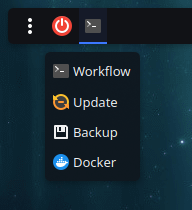
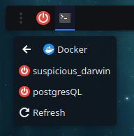
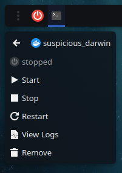
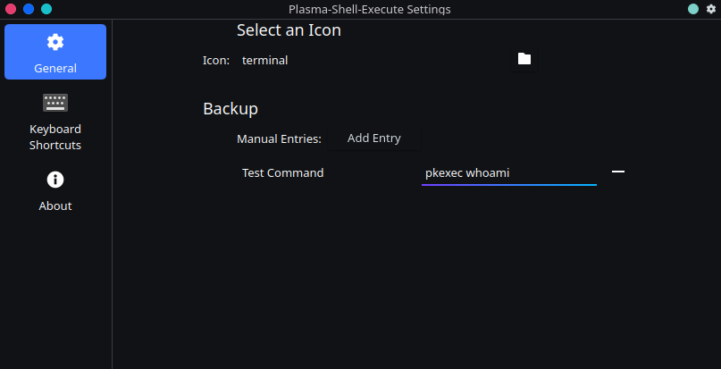
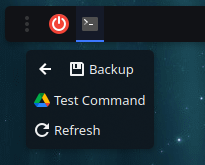

# Plasma-Panel-Shell-Execute
A Plasma Panel Widget that has a drop down menu to execute shell scripts.

Currently just an idea. Don't know if it would actually work. (It does work)

\
Note:

Made with the help of AI

